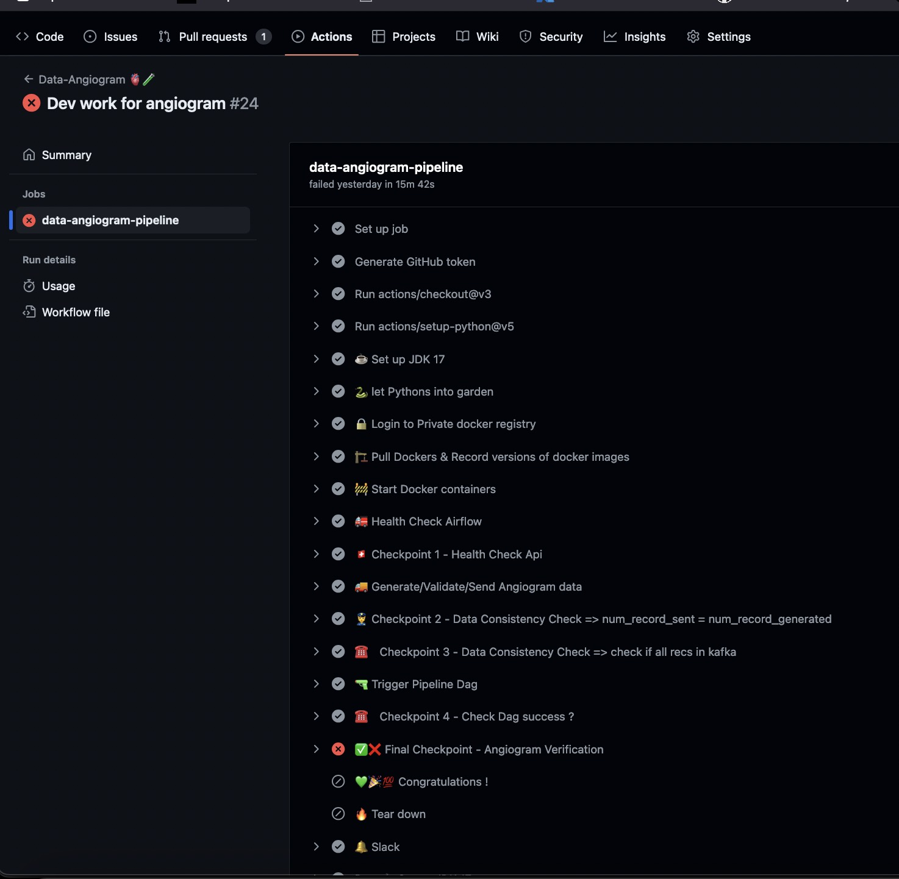

# data-angiogram 🫀🧪
Demonstrating how to perform a data angiogram on a data pipeline to assess pipeline sanity & data quality.

## What is a Data Angiogram?

A data angiogram is a technique to assess the health of a data pipeline. 

It is inspired by the medical procedure called angiogram, which is used to visualize the blood vessels in the body and
identify any blockages or other issues which may lead to heart attacks

In the context of a data pipeline, a data angiogram is used to visualize the data as it flows through the pipeline. 
It helps to identify data quality issues, bottlenecks, and other problems in the pipeline.

To be specific, a Data Angiogram is a curated Test dataset, which one injects into a Data Pipeline, 
& then actual Vs expected results of each job/component are compared in the pipeline.

## Why do we need a Data Angiogram?

Data pipelines are complex systems that are prone to data quality issues which can have disastrous consequences.

An example is Uber's data pipeline which had a bug that caused incorrect driver payments.
https://www.montecarlodata.com/blog-bad-data-quality-examples/

Data Angiograms help to identify these issues early in the pipeline before they cause any damage.

## How to create a Data Angiogram?

This project is a demonstration of how one can create a sime data angiogram for a data pipeline.

It uses the following tools:

* github worflow as the environment to run the angiogram
* airflow as the data pipeline orchestrator which runs your data pipeline dag.
* postgres,kafka as the supporting data infrastructure
* pytest for various tests

This demonstration shows a cos-effective simple method to create a data angiogram for your data pipeline using the above tools.

## Demo of this project

Go the https://github.com/jaihind213/data-angiogram/actions to see the github workflow in action.

By default it will fail as the revenue calculation is incorrect - to showcase the data angiogram in action.

refer to create_stats_from_taxi_rides.py to see the code for the pipeline.

You can fix the revenue calculation in the code & see the pipeline pass.



## Where was this idea presented first? and where are the slides ?

This idea was first presented by me at the [Smart Data 2024 conference](https://smartdataconf.ru/en/talks/124ab9dc49fa49ef8fc746eefecb9db1/?referer=%2Fen%2Fpersons%2Ff699b5d2a3514e6aaa50e92ece77f414%2F).


## Project Setup on your local

### Requirements
```bash
# Clone the repository
cd <PROJECT_DIR>
mamba create -n data-angiogram python=3.10
mamba activate data-angiogram
mamba install poetry
poetry install
```

### Running the data Pipeline on your local
```bash
# start up the infra
docker-compose up postgres -d;sleep 10;
docker-compose up zookeeper -d;sleep 20;
docker-compose up kafka -d;sleep 30;
docker-compose up init-kafka;
docker-compose up angiogram-api -d;sleep 10;
docker-compose up airflow-init;
docker-compose up airflow-scheduler airflow-webserver -d;
sleep 240;
# generate test data & validate it
bash test-scenarios/test-for-revenue/generate_validate_angiogram_data.sh
bash test-scenarios/test-for-revenue/send_angiogram_data.sh
# prepare airflow dags
poetry export --without-hashes --format=requirements.txt > dags/requirements.txt
cp create_stats_from_taxi_rides.py dags/
cp kafka_to_parquet_job.py dags/
echo "installing deps inside airflow...."
docker exec -t airflow_scheduler pip3 install --no-cache-dir -r  /opt/airflow/dags/requirements.txt
# trigger dag
bash trigger_dag.sh taxi_revenue_by_car_model_date
sleep 40
# check the stats data
parq airflow-data/angiogram_data/stats_data/stats.parquet --head 100
pwd=`pwd`
# verify the angiogram by looking at the output data of the pipeline
export STATS_DATA_PATH=${pwd}/airflow-data/angiogram_data/stats_data
pytest verify_angiogram.py
```

## If you like this project idea, please give it a star.

https://buymeacoffee.com/techteachr

## Who am i?

Ps: I am the Chief Inspiration officer at https://Bytespire.io

happy to help you with your Cost Based Data Engineering needs.

feel to reach out to me at [LinkedIn](https://www.linkedin.com/in/213vishnu/) or [X](https://x.com/sweetweet213)

[Book a free consultation](https://calendly.com/jaihind213/30min)